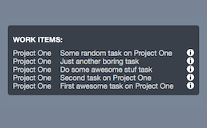

# VSTS Widget

> Made for [Übersicht](http://tracesof.net/uebersicht/)

## Requirements

You have to have installed Python 2.7 to make this widget work!

In the ```index.coffee``` you should change the following variables defined on the top:

* ```personalAccessToken = '<personal-access-token>'``` - create one if you don't have one [see here for more info](https://www.visualstudio.com/en-us/docs/integrate/get-started/auth/overview)
* ``` instance = '<instance>' ``` - VS Team Services account ({instance}.visualstudio.com)
* ``` project = '<project-name>' ``` - name of the project in which is defined the query you want
* ``` queryId = '<query-id>' ``` - open the desired query copy the query id from url ({instance}.visualstudio.com/DefaultCollection/{project}/_workitems?id={queryId}&_a=query)

## Screenshot



## Contribute

Feel free to do pull request or open an issue! :)

## License

VSTS Widget for Übersicht is released under the [MIT License](http://www.opensource.org/licenses/MIT).